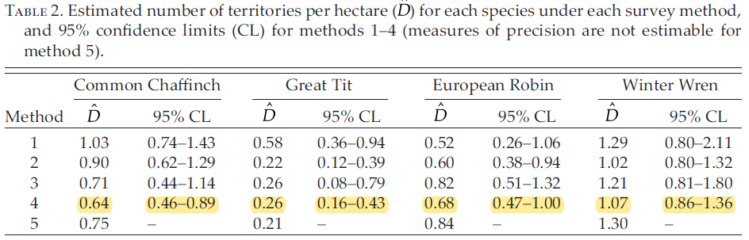

```{r include=FALSE}
knitr::opts_chunk$set(eval=TRUE, echo=TRUE, message=FALSE, warnings=FALSE)
library(kableExtra)
options(kableExtra.html.bsTable = TRUE)
```

# Background
  
Sometimes the focal species of a distance sampling survey is quite rare.  So rare that it is difficult to accumulate sufficient detections to fit a detection function for the species in question.  Likewise, it is also common for other species to be detected during the survey for the focal species.  Could the detections of the other species be useful in estimating a detection function for the focal species?

One approach might be to consider the species to serve as "strata" and proceed to analyse the data as if they were from a stratified survey.  See the [example for stratified survey analysis](http://distancesampling.org/Distance/web-only/strata/strata-distill.html).  However, if a pooled detection function (one that combines data from multiple species) is fitted, it would be dubious to apply this pooled detection function to data at a lower level of aggregation (species level).  Applying the pooled detection function would lead to a biased estimate of abundance for the rare species.

Instead of treating species as strata, an alternative form of analysis is to treat species as a covariate in the modelling of the detection function [@FMARBUC03].  The principle is that the general key function is shared across species, but the scale parameter $(\sigma)$ differs between species.  In this way, the detections of all species is shared, such that the estimation of the detection function for the rare species is bolstered by information from other species; yet the rare species receives its own *unique* detection function such that bias is not induced in the abundance estimation for that species.

To demonstrate such an analysis, the Montrave songbird study conducted by Buckland [-@Buckland2006] is used.  The species covariate approach to analysis of the snapshot point count version of his survey is described in the book by Buckland et al. [-@buckland2015distance, Section 5.3.2.2].  The `Distance` R package [@miller_distance_2019] is used to analyse the line transect survey Buckland conducted.  Results are compared with estimates presented by Buckland [-@Buckland2006].

The data are available online at a website that serves as a companion to Buckland et al. [-@buckland2015distance].  The data set can be read into R directly from the URL.

```{r readdata}
theurl <-"https://www.creem.st-andrews.ac.uk/files/2023/01/montrave-line_csv.zip"
download.file(theurl, destfile = "montrave.zip", mode = "wb")
unzip("montrave.zip")
birds <- read.csv("montrave-line.csv")
birds$object <- NA
birds$object[!is.na(birds$distance)] <- 1:sum(!is.na(birds$distance))
```

# Data preparation

Only one slight modification to the data needs to be conducted before they can be analysed.  Buckland [-@Buckland2006] made two transits of the transects, the line transect effort needs to be modified to reflect the multiple visits.

```{r prep}
birds$Effort <- birds$Effort * birds$repeats   # two visits
library(Distance)
convunit <- convert_units("meter", "kilometer", "hectare")
```

# Detections by species

In Buckland's [-@Buckland2006] line transect survey, three of the four songbird species (c-chaffinch, g-great tit, r-robin, w-winter wren) were detected in sufficient quantities that sample size is not an issue.  However, the great tit was only detected 32 times, making the support for this species open to question.

```{r numdetects, echo=FALSE}
knitr::kable(table(birds$species),
             caption="Number of detections by species for Montrave line transect survey.") %>%
   kable_styling(bootstrap_options = "striped", full_width = F) %>%
  row_spec(2, bold=T, background="yellow")
```

As mentioned in the Background, we could fit a pooled detection function across species and with species as a stratification criterion produce species-specific density estimates using the pooled detection function in conjunction with species-specific encounter rates.  However that would be using the *wrong* detection function for every species.  We take the alternative analysis route and incorporate species into the detection function.

# Covariate in detection function

Inclusion of `species` as a covariate in the detection function is simple using the `formula=` argument in `ds()`.  Note the species names are coded as letters, `R` will automatically treat a variable containing letters as a factor covariate.  If numbers were used in coding species, `as.factor` would need to be employed.

```{r detfn}
all.birds <- ds(data = birds, key="hn", convert_units = convunit,
                formula=~species, truncation = 95)
```

```{r gof, echo=FALSE}
fit <- gof_ds(all.birds, plot=FALSE)
stat <- round(fit$dsgof$CvM$W,3)
p <- round(fit$dsgof$CvM$p,3)
```

The CvM goodness of fit test indicates this model adequately fits the data, W=`r stat`, P=`r p`.

# Visualising the detection functions for each species

The shape of the species-specific detection functions can be seen by using the plotting function provided below.

```{r plotcode, fig.dim=c(7,5), fig.cap="Species-specific detection functions." }
plot(all.birds, showpoints=FALSE, main="Montrave line transects\nspecies as covariate")
add.df.covar.line(all.birds, data=data.frame(species="c"), lwd=3, lty=1, col="blue")
add.df.covar.line(all.birds, data=data.frame(species="g"), lwd=3, lty=1, col="darkgreen")
add.df.covar.line(all.birds, data=data.frame(species="r"), lwd=3, lty=1, col="brown")
add.df.covar.line(all.birds, data=data.frame(species="w"), lwd=3, lty=1, col="salmon")
legend("topright", legend=c("chaffinch", "great tit", "robin", "winter wren"),
       lwd=3, lty=1, col=c("blue", "darkgreen", "brown", "salmon"))
```

# Species-specific density estimates 

Density estimates for each species can be produced by using the `dht2` function that contains the argument `strat_formula` used to specific the levels of stratum-specific estimates requested.  The `stratification` argument ensures the correct measures of precision are associated with the species-specific density estimates.  The value `object` indicates this analysis is a form of post-stratification, rather than geographic stratification criterion that could have been know prior to the gathering of the data.

```{r densest}
bird.ests <- dht2(ddf=all.birds, flatfile=birds,
                  strat_formula = ~species, convert_units = convunit,
                  stratification = "object") 
```

```{r maketable, echo=FALSE}
density <- attr(bird.ests, "density")
knitr::kable(density[1:4 ,c(1,3,7,8,11,10)],
             digits = c(NA,0,3,3,3,3),
             caption="Species-specific density estimates using detection function with species as covariate.") %>%
  kable_styling(bootstrap_options = "striped", full_width = F)
```

# Compare with published estimates

The density estimates for chaffinch and great tits match those reported by Buckland [@Buckland2006] almost exactly.  The congruence between estimates produced by this analysis and those reported by Buckland are less good for the robins and winter wrens.

```{r screenclip, fig.dim=c(7,5), fig.cap="Reproduction of Table 2 of Buckland (2006).", echo=FALSE}

```

# Postscript

As described by Buckland [@Buckland2006], there was some reason to believe evasive movement took place on the part of robins and winter wrens.  Conceivably, this could be accommodated by using a hazard rate key function for those two species.  This would lead to a more complex analysis in which the data set was divided into a *chaffinch/great tit* data set, with a half normal key and species covariate detection function model.  The other portion of the data set would contain *robins/winter wrens* modelled using a hazard rate key function and species covariate.

```{r stuff, echo=FALSE}
chafgt <- birds[birds$species %in% c("c","g"), ]
chafgt <- droplevels(chafgt)
last.row <- dim(chafgt)[1] + 1
chafgt[last.row, "Region.Label"] <- "Montrave"
chafgt[last.row, "Area"] <- 33.2
chafgt[last.row, "repeats"] <- 2
chafgt[last.row, "Sample.Label"] <- 12
chafgt[last.row, "Effort"] <- unique(birds[birds$Sample.Label==12, "Effort"]) * 2
chafgt[last.row, "distance"] <- NA
chafgt[last.row, "species"] <- NA
chafgt[last.row, "visit"] <- NA

robwren <- birds[birds$species %in% c("r","w"), ] 
robwren <- droplevels(robwren)
hn.birds <- ds(data = chafgt,
               key="hn", convert_units = convunit,
               formula=~species, truncation = 95)
hr.birds <- ds(data = robwren,
               key="hr", convert_units = convunit,
               formula=~species, truncation = 95)

gof.cg <- gof_ds(hn.birds, plot=FALSE)$dsgof$CvM
gof.rw <- gof_ds(hr.birds, plot=FALSE)$dsgof$CvM

compare.test <- data.frame(analysis=c("Single analysis", "HN key", "HR key"),
                           "CvM W"=round(c(stat, gof.cg$W, gof.rw$W),3),
                           "P value"=round(c(p, gof.cg$p, gof.rw$p),3))

chafgt.ests <- dht2(ddf=hn.birds, flatfile=chafgt,
                  strat_formula = ~species, convert_units = convunit,
                  stratification = "object")  
robwren.ests <- dht2(ddf=hr.birds, flatfile=robwren,
                    strat_formula = ~species, convert_units = convunit,
                    stratification = "object")  
```

Indeed, the goodness of fit for this more complex analysis (not shown) leads to better fit of the "two model" approach:

```{r fittab, echo=FALSE}
knitr::kable(compare.test, caption="Goodness of fit comparison for single model compared with HN/HR split.") %>%
  kable_styling(bootstrap_options = "striped", full_width = F)
```

# References