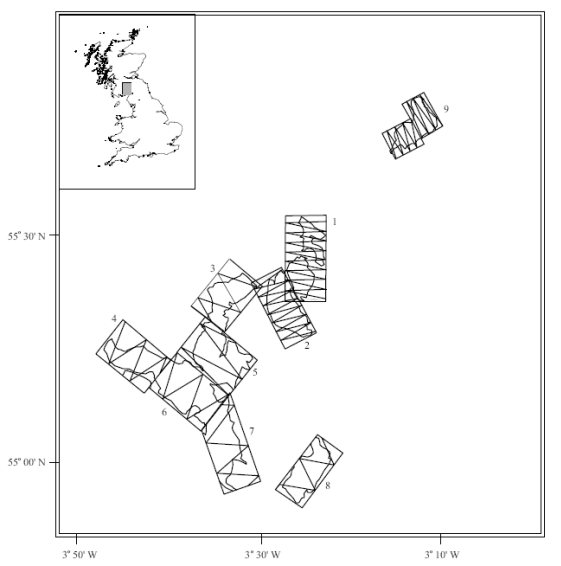

```{r include=FALSE}
knitr::opts_chunk$set(eval=TRUE, echo=TRUE, message=FALSE, warnings=FALSE)
```

We consider indirect methods to estimate abundance and hence include multipliers in the abundance calculations. The first problem uses data from a dung survey of deer and there are two levels of multipliers that need to be incorporated in the analysis (dung production rate and dung decay rate).

# Objectives

The objectives of this exercise are to

- Fit detection functions to cues
- Obtain relevant multipliers
- Use the multipliers in the `dht2` function to obtain animal abundances. 

# Dung survey of deer

The question is how to estimate of the density of sika deer in a number of woodlands in the Scottish Borders [@Maretal01]. These animals are shy and will be aware of the presence of an observer before the observer detects them, making surveys of this species challenging. As a consequence, indirect estimation methods have been applied to this problem. In this manner, an estimate of density is produced for some sign generated by deer (in this case, faecal or dung pellets) and this estimate is transformed to density of deer ($D_{\textrm{deer}}$) by

$$ \hat D_{\textrm{deer}} = \frac{\textrm{dung deposited daily}}{\textrm{dung production rate (per animal)}} $$
where the dung deposited daily is given by

$$ \textrm{dung deposited daily} = \frac{\hat D_{\textrm{pellet groups}}}{\textrm{mean time to decay}} $$
Hence, we use distance sampling to produce a pellet group density estimate, then adjust it accordingly to account for the production and decay processes operating during the time the data were being acquired. We will also take uncertainty in the dung production and decay rates into account in our final estimate of deer density.

Data from 9 woodlands (labelled A-H and J) were collected according to the survey design (Figure \@ref(fig:map)) but note that data from block D were not included in this exercise.

```{r map, echo=FALSE, fig.cap="Location of sika deer survey in southern Scotland and the survey design (from  [@Maretal01]). Note the differing amounts of effort in different woodlands based on information derived from pilot surveys."}

```

In addition to these data, we also require estimates of the production rate. From a literature search, we learn that sika deer produce 25 pellet groups daily but this source did not provide a measure of variability of this estimate. During the course of our surveys we also followed the fate of some marked pellet groups to estimate the decay (disappearance) rates of a pellet group. A thorough discussion of methods useful for estimating decay rates and associated measures of precision can be found in Laing et al. [-@Laietal03].

There are many factors that might influence both production and decay rates, and for purposes of this exercise we will make the simplifying assumption that decay rate is homogeneous across these woodlands; with their mean time to decay of 163 days and a standard error of 13 days. (If you were to conduct a survey such as this, you would want to investigate this assumption more thoroughly.)

## Getting started

These data (called `sikadeer`) are available in the `Distance` package. Detection of deer dung takes place at small spatial scales; perpendicular distances are measured in centimeters.  But transects were long; measured in kilometers and deer densities are customarily reported in numbers kilometer^-2^.

```{r, message=FALSE}
library(Distance)
data(sikadeer)
conversion.factor <- convert_units("centimeter", "kilometer", "square kilometer")
```

## Fit detection function to dung pellets

Fit the usual series of models (i.e. half normal, hazard rate, uniform) models to the distances to pellet groups and decide on a detection function.  This detection function (Figure \@ref(fig:detfn)) will be used to obtain $\hat D_{\textrm{pellet groups}}$.

```{r detfn, fig.dim=c(7,5), fig.cap="Simple detection function to deer pellet line transect data."}
deer.df <- ds(sikadeer, key="hn", truncation="10%", convert_units = conversion.factor)
plot(deer.df, main="Half normal detection function")
print(deer.df$dht$individuals$summary)
```

Have a look at the `Summary statistics` for this model - note some woodlands have but a single transect of effort allocated.

## Multipliers

The next step is to create an object which contains the multipliers we wish to use. We already have estimates of dung production rates but need similar information on dung decay (or persistence) rate.  Analysis is based upon methods presented in Laing et al. [-@Laietal03].

Data to calculate dung persistence has been collected in the file [dung_persistence.csv](dung_persistence.csv). Following code from [@Meredith2017].

```{r, logistic, fig.dim=c(7,5), fig.cap="Logistic curve fitted to pellet persistence survey data.  Vertical line represents day at which 50% of pellets have decayed to non-detectable."}
MIKE.persistence <- function(DATA) {
  
#  Purpose: calculate mean persistence time (mean time to decay) for dung/nest data 
#  Input: data frame with at least two columns:
#         DAYS - calendar day on which dung status was observed
#         STATE - dung status: 1-intact, 0-decayed
#  Output: point estimate, standard error and CV of mean persistence time
#
#  Attribution: code from Mike Meredith website: 
#      http://www.mikemeredith.net/blog/2017/Sign_persistence.htm
#   Citing: CITES elephant protocol
#      https://cites.org/sites/default/files/common/prog/mike/survey/dung_standards.pdf
  
  ##   Fit logistic regression model to STATE on DAYS, extract coefficients
  dung.glm <- glm(STATE ~ DAYS, data=DATA, family=binomial(link = "logit"))
  betas <- coefficients(dung.glm)
  ##   Calculate mean persistence time
  mean.decay <- -(1+exp(-betas[1])) * log(1+exp(betas[1])) / betas[2]
  ## Calculate the variance of the estimate
  vcovar <- vcov(dung.glm)
  var0 <- vcovar[1,1]  # variance of beta0
  var1 <- vcovar[2,2]  # variance of beta1
  covar <- vcovar[2,1] # covariance
  deriv0 <- -(1-exp(-betas[1]) * log(1+exp(betas[1])))/betas[2]
  deriv1 <- -mean.decay/betas[2]
  var.mean <- var0*deriv0^2 + 2*covar*deriv0*deriv1 + var1*deriv1^2
  ## Calculate the SE and CV and return
  se.mean <- sqrt(var.mean)
  cv.mean <- se.mean/mean.decay
  out <- c(mean.decay, se.mean, 100*cv.mean)
  names(out) <- c("Mean persistence time", "SE", "%CV")
  plot(decay$DAYS, jitter(decay$STATE, amount=0.10), xlab="Days since initiation",
       ylab="Dung persists (yes=1)",
       main="Eight dung piles revisited over time")
  curve(predict(dung.glm, data.frame(DAYS=x), type="resp"), add=TRUE)
  abline(v=mean.decay, lwd=2, lty=3)
  return(out)
}
decay <- read.csv("dung_persistence.csv")
persistence.time <- MIKE.persistence(decay)
print(persistence.time)
```

Running the above command should have produced a plot of dung persistence versus days since produced and fitted a logistic regression (this is like a simple linear regression but restricts the response to taking values between 0 and 1). Note the points can in reality only take values between 0 and 1 but for the purposes of plotting have been 'jittered' to avoid over-plotting.

An estimate of mean persistence time and measure of variability are also provided - make a note of these as they will be required below. Dotted vertical line indicates the time at which the estimated probability of persistence is 0.5.

As stated above, we want an object which contains information on the dung production rate (and standard error) and dung decay rate (and standard error). The following command creates a list containing two data frames: 

+ `creation` contains estimates of the dung production rate and associated standard error
+ `decay` contains the dung decay rate and associated standard error where `XX` and `YY` are the estimates obtained from the dung decay rate analysis.

```{r}
# Create list of multipliers
mult <- list(creation = data.frame(rate=25, SE=0),
             decay    = data.frame(rate=163, SE=14.2))
print(mult)
```

The final step is to use these multipliers to convert $\hat D_{\textrm{pellet groups}}$ to $\hat D_{\textrm{deer}}$ (as in the equations above) - for this we need to employ the `dht2` function. In the command below the `multipliers=` argument allows us to specify the rates and standard errors. There are a couple of other function arguments that need some explanation:

+ `strat_formula=~Region.Label` is specified to take into account the design (i.e. different woodlands or blocks).
+ `stratification="geographical"` is specified because we want to produce an overall estimate density that is the mean of the woodland specific densities weighted by area of each block. 
+ `deer.df` is the detection function you have fitted.

```{r}
deer.ests <- dht2(deer.df, flatfile=sikadeer, strat_formula=~Region.Label,
                 convert_units=conversion.factor, multipliers=mult, 
                 stratification="geographical")
print(deer.ests, report="density")
```

# Other `stratification` choices with `dht2`

This example of Sika deer on different hunting estates uses geographical stratification.  There is also the option of using the option `replicate` for the `stratification` argument.  This is useful when there are repeated surveys in a geographic area; the average abundance is computed and variance is variability between surveys.  Alternatively `effort_sum` is used with replicate surveys, but few replicates reporting average variance.  Finally, the specification of `stratification="object"` can be used when detections are made of different species, sexes or ages of animals.  This option will produce species-specific abundance estimates as well as abundance estimate over all species, properly calculating variance of total abundance.  More information is available in [this diagramatic comparison](strat.pdf) as well as in the help file for `?dht2`.

The function `dht2` also provides information on the components of variance. Make a note of the these (contribution of detection function, encounter rate, decay rate and what happened to production rate component?) in each strata.


# Notes regarding this dung survey

+ overall estimate of density 
  - most effort took place in woodland A where deer density was high. Therefore, the overall estimate is between the estimated density in woodland A and the lower densities in the other woodlands. 
+ components of variance 
  - we now have uncertainty associated with the encounter rate, detection function and decay rate (note there was no uncertainty associated with the production rate) and so the components of variation for all three components are provided. 

In woodland A, there were 13 transects on which over 1,200 pellet groups were detected: uncertainty in the estimated density (measured by CV) was 19\% and the variance components were apportioned as detection probability 4\%, encounter rate 76\% and multipliers 20\%. 

In woodland E, there were 5 transects and 30 pellet groups resulting in a coefficient of variation (CV) of 48\%: the variance components were apportioned as detection probability 0.7\%, encounter rate 96\% and multipliers 3\%. 

The CV of the abundance estimates for blocks F, H and J are identical (9\%) because a pooled detection function was used across all blocks and the dung deposition and decay rates were not block-specific.  The only element of the computation remaining that is block-specific is the encounter rate; and for these three blocks there was but a single transect per block, meaning the encounter rate variance could not be computed and was set to zero.

The estimated abundance across all blocks had a CV of 14\%.  But far and away, the greatest contribution to this uncertainty was encounter rate variance--differences in pellet encounters between transects.  In the context of distance sampling, the uncertainty in the parameter estimates of the detection function accounts for <1\% in the total estimate of deer abundance across the blocks.

# References
